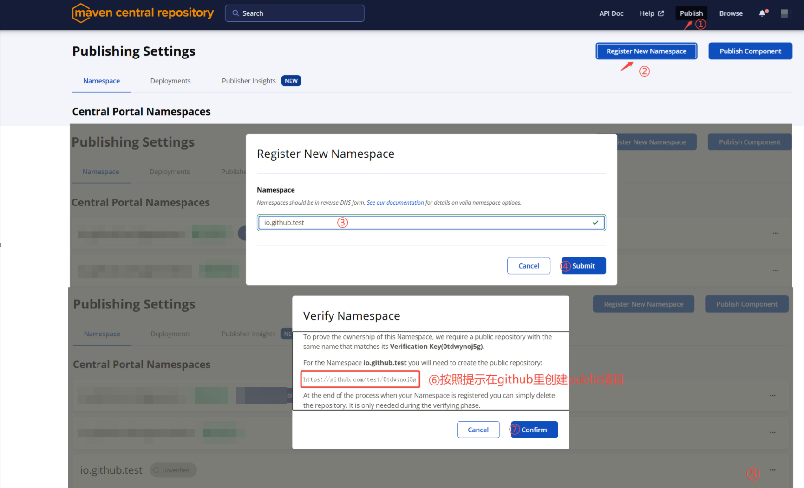
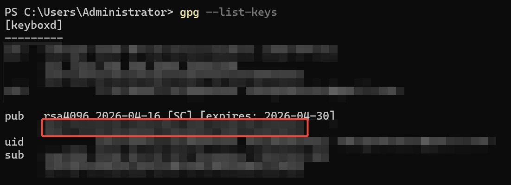
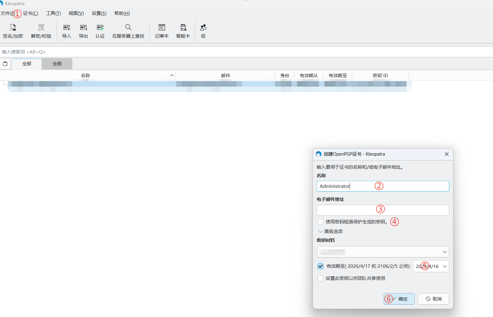
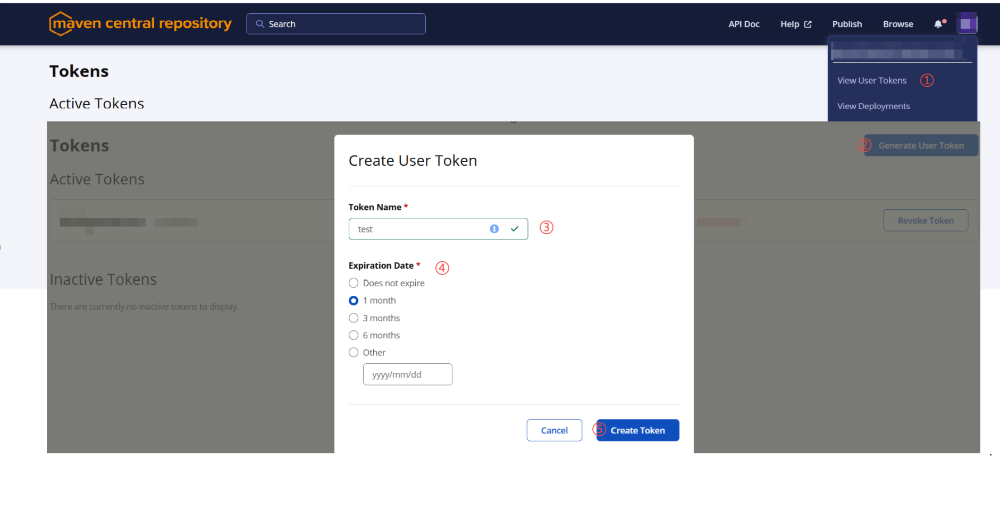
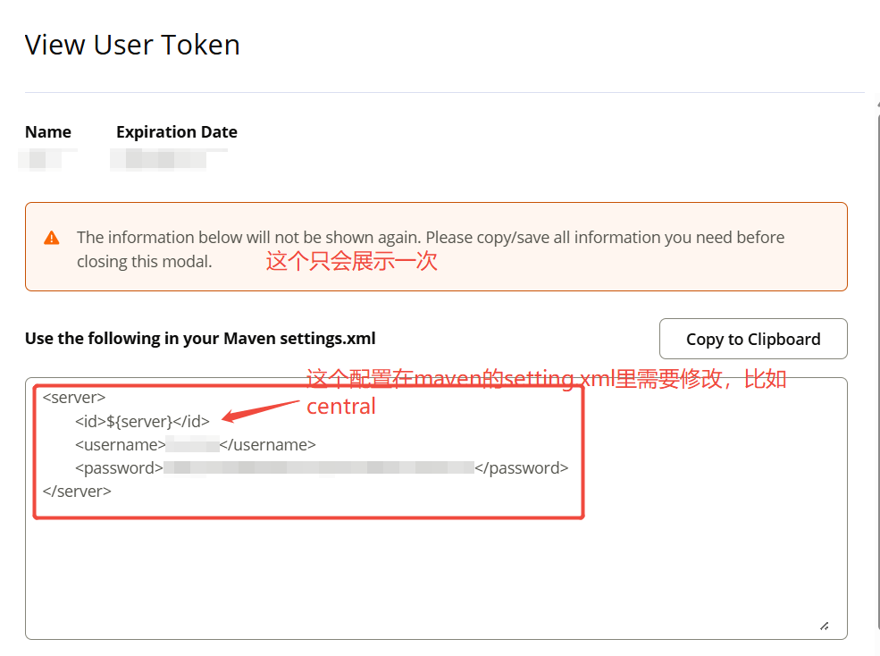

# 一、前期准备

## 1. 注册 Sonatype 账号

访问 [central.sonatype.com](https://central.sonatype.com/) 注册账号（可使用 GitHub、Google 或邮箱）。

## 2. 申请并验证 Namespace

`Namespace` 是 Maven 坐标中的 groupId，格式为反向规则：

| 场景        | 格式                             | 示例                           |
|-----------|--------------------------------|------------------------------|
| 拥有域名      | com.yourdomain 或 io.yourdomain | 域名 example.com → com.example |
| 使用 GitHub | io.github.用户名                  | io.github.kotlinhandson      |
| 使用 Gitee  | io.gitee.用户名                   | io.gitee.myname              |
| 使用 GitLab | io.gitlab.用户名                  | io.gitlab.myname             |

登录后进入 `Publish → Namespaces` 页面，点击 `Register New Namespace`：


**注意：需要按照页面的提示在GitHub上创建一个项目验证Namespace，验证通过后才可后续进行发布**

## 3. 生成并上传 GPG 密钥

Maven Central 强制要求对所有发布文件进行 GPG 签名，以确保组件未被篡改。

```bash
# 生成密钥对（按提示填写姓名、邮箱等）
gpg --full-generate-key

# 查看已生成的密钥，获取公钥 ID
gpg --list-keys

# 将公钥上传到公共密钥服务器
gpg --keyserver keyserver.ubuntu.com --send-keys 你的公钥ID
```


> 图片里**红色框所在的位置**即为公钥ID </br>
**使用与 Sonatype 账号相同的邮箱**，并妥善保管私钥和密码</br>
> 在创建公私钥的过程中会要求输入密码，这个密码要记好，后续deploy到Maven Central需要使用

### 3.1 Window 界面操作CPG密钥

[https://www.gpg4win.org/download.html](https://www.gpg4win.org/download.html)

下载gpg4win软件，下载后安装

#### 创建 GPG 密钥对



#### 添加 GPG 密钥到公共密钥服务器

```bash
gpg --keyserver hkp://keyserver.ubuntu.com --send-keys 你的公钥ID
```

> **通过gpg命令创建的密钥对会自动在Kleopatra中加载**

### Mac 界面操作CPG密钥

> 待补充

[https://gnupg.org/download/index.html](https://gnupg.org/download/index.html)

## 4. 生成 User Token

进入 Central Portal 的 Account 页面，点击 `Generate User Token`，复制生成的用户名和密码，用于构建工具的身份认证。


点击 "Generate Token"后，会看到如下提示：


**注意：**

- 上述信息只会展示一次，务必复制保存好

## 5. 配置 GPG 密钥

在 ~/.m2/settings.xml 中添加以下内容：

```xml

<servers>
    <server>
        <id>central</id>
        <username>Sonatype生成的Token用户名</username>
        <password>Sonatype生成的Token密码</password>
    </server>
</servers>
```

**注意：**

- `central` 是服务器的 ID，需要与 pom.xml 中的 `<distributionManagement>` 中的 `<id>` 匹配。
- `Sonatype生成的Token用户名` 和 `Sonatype生成的Token密码` 是在 Sonatype 上生成的用户名和密码。
- `~/.m2/settings.xml` 是 Maven 的全局配置文件，用于配置全局的认证信息。

# 二、项目配置与发布

## 🔧 项目 Maven 配置

请确保你的 `pom.xml` 中包含以下关键信息。这些是发布到 Central 的硬性要求。

```xml
<!-- 基础元信息 -->
<name>Your Library Name</name>
<description>Brief description of your library</description>
<url>https://github.com/username/repo</url>

<licenses>
    <license>
      <name>Apache License, Version 2.0</name>
      <url>http://www.apache.org/licenses/LICENSE-2.0.txt</url>
    </license>
</licenses>

<developers>
    <developer>
      <name>Your Name</name>
      <email>your-email@example.com</email>
    </developer>
</developers>

<scm>
    <url>https://github.com/username/repo</url>
    <connection>scm:git:https://github.com/username/repo.git</connection>
</scm>
```

在 `pom.xml` 中继续添加以下内容：

```xml

<properties>
    <maven.compiler.source>17</maven.compiler.source>
    <maven.compiler.target>17</maven.compiler.target>
    <project.build.sourceEncoding>UTF-8</project.build.sourceEncoding>
    <maven.compiler.plugin.version>3.8.1</maven.compiler.plugin.version>
    <maven.source.plugin.version>3.3.0</maven.source.plugin.version>
    <maven.javadoc.plugin.version>3.6.0</maven.javadoc.plugin.version>
    <central.publishing.plugin.version>0.9.0</central.publishing.plugin.version>
    <gpg.maven.plugin>3.1.0</gpg.maven.plugin>
</properties>

<plugins>
    <plugin>
        <groupId>org.apache.maven.plugins</groupId>
        <artifactId>maven-compiler-plugin</artifactId>
        <version>${maven.compiler.plugin.version}</version>
        <configuration>
            <source>${maven.compiler.source}</source>
            <target>${maven.compiler.target}</target>
            <encoding>${project.build.sourceEncoding}</encoding>
        </configuration>
    </plugin>
    <plugin>
        <groupId>org.apache.maven.plugins</groupId>
        <artifactId>maven-source-plugin</artifactId>
        <version>${maven.source.plugin.version}</version>
        <executions>
            <execution>
                <id>attach-sources</id>
                <goals>
                    <goal>jar-no-fork</goal>
                </goals>
            </execution>
        </executions>
    </plugin>
    <plugin>
        <groupId>org.apache.maven.plugins</groupId>
        <artifactId>maven-javadoc-plugin</artifactId>
        <version>${maven.javadoc.plugin.version}</version>
        <executions>
            <execution>
                <id>attach-javadocs</id>
                <goals>
                    <goal>jar</goal>
                </goals>
            </execution>
        </executions>
    </plugin>
</plugins>
```

在 `pom.xml` 中继续添加以下内容，以插件的形式发布到 Maven Central 仓库

```xml
<!-- 官方插件负责将你的工件打包并上传到 Central Portal -->
<profiles>
    <profile>
        <id>release</id>
        <build>
            <plugins>
                <!-- GPG 签名插件：对所有文件进行签名 -->
                <plugin>
                    <groupId>org.apache.maven.plugins</groupId>
                    <artifactId>maven-gpg-plugin</artifactId>
                    <version>${gpg.maven.plugin}</version>
                    <executions>
                        <execution>
                            <id>sign-artifacts</id>
                            <phase>verify</phase>
                            <goals>
                                <goal>sign</goal>
                            </goals>
                        </execution>
                    </executions>
                </plugin>

                <!-- 官方插件负责将你的工件打包并上传到 Central Portal -->
                <plugin>
                    <groupId>org.sonatype.central</groupId>
                    <artifactId>central-publishing-maven-plugin</artifactId>
                    <version>${central.publishing.plugin.version}</version>
                    <extensions>true</extensions>
                    <configuration>
                        <publishingServerId>central
                        </publishingServerId> <!-- 配置发布服务器的 ID, 必须与 settings.xml 中的 server 配置匹配 -->
                    </configuration>
                </plugin>
            </plugins>
        </build>
    </profile>
</profiles>
```

> ** 注意：**使用<profile>标签以实现发布的特定配置，避免对所有的构建都进行签名和发布。 </br>
> <publishingServerId> 配置发布服务器的 ID, 必须与 settings.xml 中的 server 配置匹配。

# 使用 Maven 命令发布：

```bash
mvn clean deploy -P release
```

这个命令将清理项目，并使用 release 配置发布到 Maven Central 仓库。

**注意：**

- `-P release` 选项将激活发布配置，并执行 GPG 签名和发布到 Central 的操作。
- `clean` 选项将清理项目，删除生成的文件。
- `deploy` 选项将发布项目到 Maven Central 仓库。
- **发布过程中需输入GPG密码（务必记牢）**。

发布过程是异步的，需要等待一段时间，直到发布完成。


** 发布失败，需手动在`Deployments`中进行Drop操作，才能再次发布，即同一版本只能发布一次。 **

