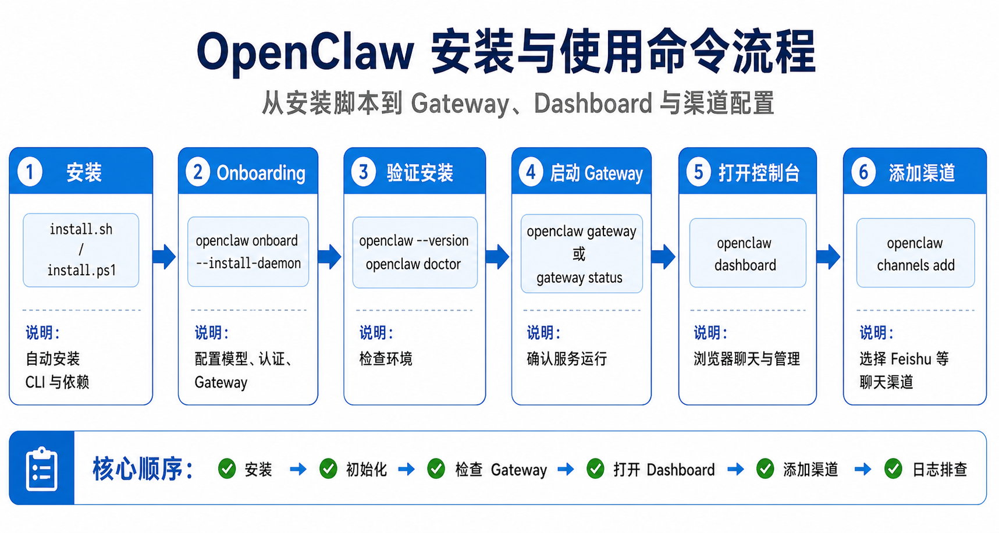
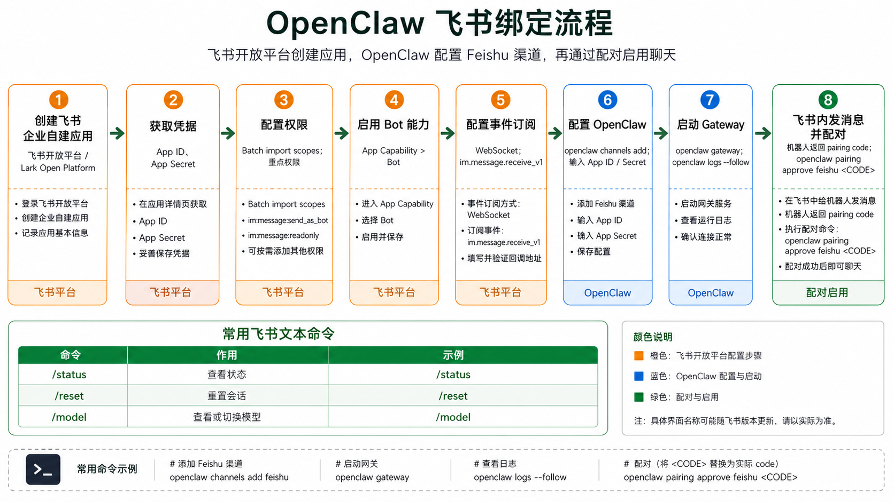

# OpenClaw 安装、使用命令与飞书绑定流程

> 参考官方文档：  
> - [Install - OpenClaw](https://docs.openclaw.ai/install)  
> - [Getting Started - OpenClaw](https://docs.openclaw.ai/start/getting-started)  
> - [CLI Setup Reference - OpenClaw](https://docs.openclaw.ai/start/wizard-cli-reference)  
> - [Feishu - OpenClaw](https://docs.openclaw.ai/channels/feishu)  
>
> 整理时间：2026-04-29，时区：Asia/Shanghai。

## 1. 安装前准备

OpenClaw 官方推荐使用安装脚本完成安装。系统要求重点如下：

- Node.js：推荐 Node 24，也支持 Node 22.14+；官方安装脚本会自动处理 Node。
- 系统：macOS、Linux、Windows 原生、WSL2 均支持；Windows 场景下 WSL2 更稳定。
- 如果从源码构建，才需要额外关注 `pnpm`。

安装与使用流程图：



## 2. 安装命令

### macOS / Linux / WSL2

```bash
curl -fsSL https://openclaw.ai/install.sh | bash
```

### Windows PowerShell

```powershell
iwr -useb https://openclaw.ai/install.ps1 | iex
```

### 安装但不立即进入 onboarding

macOS / Linux / WSL2：

```bash
curl -fsSL https://openclaw.ai/install.sh | bash -s -- --no-onboard
```

Windows PowerShell：

```powershell
& ([scriptblock]::Create((iwr -useb https://openclaw.ai/install.ps1))) -NoOnboard
```

### 本地 prefix 安装方式

适合希望把 OpenClaw 和 Node 都放在本地目录，例如 `~/.openclaw`，不依赖系统级 Node 的场景：

```bash
curl -fsSL https://openclaw.ai/install-cli.sh | bash
```

### npm / pnpm / bun 安装方式

如果你自己管理 Node，可以用包管理器安装：

```bash
npm install -g openclaw@latest
openclaw onboard --install-daemon
```

```bash
pnpm add -g openclaw@latest
pnpm approve-builds -g
openclaw onboard --install-daemon
```

```bash
bun add -g openclaw@latest
openclaw onboard --install-daemon
```

### 从源码安装

```bash
git clone https://github.com/openclaw/openclaw.git
cd openclaw
pnpm install && pnpm ui:build && pnpm build
pnpm link --global
openclaw onboard --install-daemon
```

## 3. 初始化与常用命令

### 首次初始化

推荐执行：

```bash
openclaw onboard --install-daemon
```

这个向导会引导完成：

- 模型与认证配置，例如 OpenAI、Anthropic、Google 等模型提供商。
- 工作区路径和引导文件。
- Gateway 端口、绑定地址、认证方式等设置。
- 渠道配置，例如 Telegram、Discord、Feishu 等。
- Daemon / 服务安装。
- 健康检查和 Skills 设置。

如果不安装 daemon，也可以运行：

```bash
openclaw onboard
```

### 验证安装

```bash
openclaw --version
openclaw doctor
openclaw gateway status
```

### 启动 Gateway

如果没有安装为服务，可以前台启动：

```bash
openclaw gateway
```

也可以指定端口：

```bash
openclaw gateway --port 18789
```

### 打开控制台

```bash
openclaw dashboard
```

如果在服务器或远程环境中，也可以访问 Gateway 所在机器的控制台地址：

```text
http://127.0.0.1:18789/
```

### Gateway 管理命令

```bash
openclaw gateway status
openclaw gateway install
openclaw gateway stop
openclaw gateway restart
openclaw logs --follow
```

### 添加聊天渠道

```bash
openclaw channels add
```

选择对应渠道，例如 Feishu，然后按提示输入凭据。

## 4. 飞书绑定流程

飞书绑定流程图：



OpenClaw 当前版本内置 Feishu 插件，通常不需要单独安装。如果使用旧版本或自定义构建，缺少 Feishu 插件时再手动安装：

```bash
openclaw plugins install @openclaw/feishu
```

### 4.1 创建飞书应用

1. 打开 [飞书开放平台](https://open.feishu.cn/) 并登录。
2. 如果是 Lark 国际版租户，使用 [Lark Open Platform](https://open.larksuite.com/app)，并在 OpenClaw 配置里设置 `domain: "lark"`。
3. 创建企业自建应用。
4. 填写应用名称、描述，并选择应用图标。

### 4.2 获取应用凭据

在飞书应用的 Credentials & Basic Info 页面复制：

- App ID，格式通常是 `cli_xxx`。
- App Secret。

注意：`App Secret` 必须保密，不要提交到代码仓库。

### 4.3 配置权限

在飞书应用的 Permissions 页面点击 Batch import，导入以下权限：

```json
{
  "scopes": {
    "tenant": [
      "aily:file:read",
      "aily:file:write",
      "application:application.app_message_stats.overview:readonly",
      "application:application:self_manage",
      "application:bot.menu:write",
      "cardkit:card:read",
      "cardkit:card:write",
      "contact:user.employee_id:readonly",
      "corehr:file:download",
      "event:ip_list",
      "im:chat.access_event.bot_p2p_chat:read",
      "im:chat.members:bot_access",
      "im:message",
      "im:message.group_at_msg:readonly",
      "im:message.p2p_msg:readonly",
      "im:message:readonly",
      "im:message:send_as_bot",
      "im:resource"
    ],
    "user": [
      "aily:file:read",
      "aily:file:write",
      "im:chat.access_event.bot_p2p_chat:read"
    ]
  }
}
```

### 4.4 启用机器人能力

在飞书应用的 App Capability > Bot 中：

1. 启用 Bot capability。
2. 设置机器人名称。

### 4.5 配置事件订阅

配置事件订阅前，先确保已经执行过 Feishu 渠道添加，并且 Gateway 正在运行：

```bash
openclaw channels add
openclaw gateway status
```

然后在飞书应用的 Event Subscription 中：

1. 选择长连接方式接收事件，即 WebSocket。
2. 添加事件：`im.message.receive_v1`。
3. 如果需要飞书云文档评论工作流，可额外添加：`drive.notice.comment_add_v1`。

官方文档提醒：如果 Gateway 没有运行，长连接事件订阅可能保存失败。

### 4.6 发布应用

在 Version Management & Release 中：

1. 创建版本。
2. 提交审核并发布。
3. 等待管理员审批；企业自建应用通常会自动通过。

## 5. 在 OpenClaw 中配置 Feishu

### 推荐方式：使用向导

```bash
openclaw channels add
```

选择 Feishu，然后粘贴 App ID 和 App Secret。

### 配置文件方式

编辑：

```text
~/.openclaw/openclaw.json
```

示例：

```js
{
  channels: {
    feishu: {
      enabled: true,
      dmPolicy: "pairing",
      accounts: {
        main: {
          appId: "cli_xxx",
          appSecret: "xxx",
          name: "My AI assistant",
        },
      },
    },
  },
}
```

如果是 Lark 国际版租户：

```js
{
  channels: {
    feishu: {
      domain: "lark",
      accounts: {
        main: {
          appId: "cli_xxx",
          appSecret: "xxx",
        },
      },
    },
  },
}
```

### 环境变量方式

```bash
export FEISHU_APP_ID="cli_xxx"
export FEISHU_APP_SECRET="xxx"
```

### Webhook 模式补充

OpenClaw 的 Feishu 文档默认强调 WebSocket 长连接模式，不需要暴露公网 webhook。只有使用 `connectionMode: "webhook"` 时，才需要额外配置：

- `channels.feishu.verificationToken`
- `channels.feishu.encryptKey`

这两个值在飞书开放平台的 Development → Events & Callbacks → Encryption 中获取。

## 6. 启动测试与配对

### 启动 Gateway

```bash
openclaw gateway
```

或者如果已经安装服务：

```bash
openclaw gateway status
openclaw gateway restart
```

### 查看日志

```bash
openclaw logs --follow
```

### 在飞书里测试

1. 在飞书中找到机器人。
2. 给机器人发送一条消息。
3. 默认情况下，机器人会返回 pairing code。
4. 在命令行批准配对：

```bash
openclaw pairing approve feishu <CODE>
```

也可以先查看待批准列表：

```bash
openclaw pairing list feishu
```

批准后即可正常聊天。

## 7. 飞书内常用文本命令

飞书目前不支持原生命令菜单，因此需要直接发送文本命令：

| 命令 | 作用 |
|---|---|
| `/status` | 查看机器人状态 |
| `/reset` | 重置当前会话 |
| `/model` | 查看或切换模型 |

## 8. 常见排查

### 机器人不响应群聊

- 确认机器人已加入群。
- 默认行为通常需要 @mention 机器人。
- 确认 `groupPolicy` 不是 `"disabled"`。
- 查看日志：

```bash
openclaw logs --follow
```

### 机器人收不到消息

- 确认应用已经发布并审批通过。
- 确认事件订阅包含 `im.message.receive_v1`。
- 确认启用了长连接。
- 确认权限完整。
- 确认 Gateway 正在运行：

```bash
openclaw gateway status
```

### App Secret 泄露

1. 在飞书开放平台重置 App Secret。
2. 更新 OpenClaw 配置。
3. 重启 Gateway：

```bash
openclaw gateway restart
```

### 消息发送失败

- 确认应用具有 `im:message:send_as_bot` 权限。
- 确认应用已发布。
- 通过日志查看详细错误：

```bash
openclaw logs --follow
```
